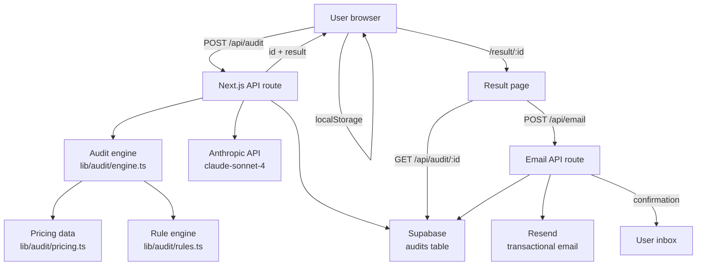

# Architecture

## System diagram



---

## Data flow: input → audit result

```
1. User fills form (app/page.tsx)
   └── useFormState hook persists to localStorage on every change

2. User clicks "Run Audit"
   └── POST /api/audit { input: AuditInput, honeypot: string }
       ├── Rate limit check (10 req/hr per IP, in-memory map)
       ├── Honeypot check (bots fill the hidden field, rejected silently)
       └── runAudit(input) → AuditResult
           ├── For each ToolEntry in input.tools:
           │   ├── Look up current plan price in PRICING table
           │   ├── Run rules: downgrade? switch vendor? seats overkill?
           │   └── Calculate monthly savings per recommendation
           ├── Sum totalMonthlySavings, totalAnnualSavings
           ├── Score 0–100 based on savings ratio
           └── Flag isAlreadyOptimal if savings < $20/mo

3. generateAISummary(result) → string
   └── POST to Anthropic API with audit result JSON
       └── On failure: templated fallback string (no crash)

4. saveAudit({ id, input, result, createdAt })
   └── INSERT into Supabase audits table
       └── If DB_ENABLED = false (no env vars): silently skip

5. Return { id, result } to browser
   └── Browser: localStorage.setItem(`audit-${id}`, data)
   └── router.push(`/result/${id}`)

6. Result page loads
   └── Try localStorage first (instant — same device, just submitted)
   └── Fallback: GET /api/audit/:id from Supabase (shared URL, different device)
       └── PII stripped: email and company not returned in public API

7. Lead capture
   └── POST /api/email { auditId, email, company?, role?, teamSize?, monthlySavings, honeypot }
       ├── Honeypot check
       ├── Rate limit (5 req/hr per IP)
       ├── saveLeadCapture() → Supabase leads table
       └── resend.emails.send() → confirmation email to user
```

---

## Why this stack

**Next.js (App Router)**
Single repo for frontend and backend. API routes in `app/api/` co-locate with the pages that call them. One deploy command, one set of secrets, one CI pipeline. The trade-off is vendor lock-in to Vercel's serverless model — acceptable at MVP scale.

**TypeScript throughout**
The audit engine makes type safety load-bearing: `AuditInput`, `ToolEntry`, `AuditResult`, `ToolRecommendation` are all fully typed. A pricing entry with the wrong shape fails at compile time, not at runtime when a user's audit silently produces $0 savings.

**Supabase (Postgres)**
Real SQL. The `audits` table stores the full `input` and `result` as JSONB — flexible for schema evolution, but queryable with `->` operators when we need to analyse which tools appear most. Row Level Security allows the anon key to insert but not read other users' data.

**Deterministic rule engine, not LLM**
The audit calculations are hardcoded TypeScript in `lib/audit/rules.ts`. This is intentional: a finance person must be able to read the logic and agree with the output. Every recommendation traces to a specific rule and a specific pricing URL. LLMs were considered and rejected for this layer — they'd need real-time web access to be accurate and can't guarantee deterministic output.

**Resend for email**
3,000 free emails/month, excellent deliverability, TypeScript-native SDK, and a clean dashboard for debugging. SES was considered but requires domain verification steps that slow down a 7-day build. Postmark is good too but costs money from day one.

---

## What would change at 10,000 audits/day

| Current | At scale |
|---|---|
| In-memory rate limit map (resets on cold start) | Redis/Upstash for shared rate limiting across instances |
| Supabase free tier | Supabase Pro or Neon with read replicas |
| Anthropic summary on every audit | Queue summaries via BullMQ — generate async, poll on result page |
| Single Next.js deployment | Split into: static frontend (CDN) + separate API service (Fly.io) |
| JSONB audit storage | Materialised views for analytics queries (top overspent tools, avg savings by team size) |
| No caching | Cache audit results by ID in Redis (immutable after creation) |
| Single Resend account | Dedicated sending domain + DKIM/DMARC for deliverability at volume |

The audit engine itself scales horizontally without changes — it's pure CPU with no shared state.